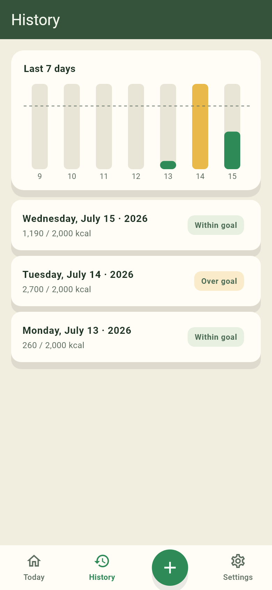

# متتبع السعرات — Libyan Calorie Tracker

A calorie counter built for Libya: local snack brands (Kalee, Bifa, Al Naseem…) and
home-cooked dishes (bazin, mbakbka, couscous, sfinz…) that global apps don't cover.

**Works offline · No signup · Your data stays on your phone · Built for Libyan food and Libyan life**

| Home (light) | Home (dark, Arabic) | History |
|---|---|---|
|  |  |  |

*(Screenshots are the actual golden-test baselines — always current.)*

## Status

**Phase 1 — finishing the front end** (public launch target: early December 2026; Ramadan mode hard deadline: 25 January 2027).

| Done | In progress / next |
|---|---|
| ✅ Home, search, meal detail screens | 🔜 Custom meal icons ([#8](../../issues/8)) |
| ✅ Goals: persisted + editable in settings | 🔜 App icon + splash ([#9](../../issues/9)) |
| ✅ Settings with EN/AR disclaimer | 🔜 Haptics ([#10](../../issues/10)) |
| ✅ History list, read-only day view, 7-day chart | 🔜 QA checklist doc ([#11](../../issues/11)) |
| ✅ Onboarding (3 pages, skippable, replayable) | 🔜 FoodItem verified flag ([#12](../../issues/12)) |
| ✅ Empty states ×4 | |

Planning docs in the repo root:

- **[PLAN.md](PLAN.md)** — full roadmap, phase gates, risk register
- **[CLAUDE.md](CLAUDE.md)** — project brief and hard requirements (read by Claude Code every session)
- **[DEV_NOTES.md](DEV_NOTES.md)** — machine setup, key commands, data pipeline pointers

## Hard rules (never violated)

- Numerals are **always Western digits (0-9)**, including in Arabic; Eastern Arabic input (٠-٩) is normalized on entry.
- Full RTL layout in Arabic; language choice persists.
- ⚠️ **All nutrition values in `lib/food_db.dart` are placeholders** until verified through the label pipeline (Phase 2). Nothing ships presented as accurate without a source.
- No barcode scanner, accounts, or social features — deliberate MVP scope.
- Neutral goal wording everywhere: no alarm red, no streak pressure (anti-eating-disorder guardrails).

## Development

Flutter 3.44.6 at `C:\dev\flutter` (not on PATH):

```powershell
C:\dev\flutter\bin\flutter.bat analyze                    # zero warnings expected
C:\dev\flutter\bin\flutter.bat test                       # full suite (36 tests)
C:\dev\flutter\bin\flutter.bat test --update-goldens test\screenshots_test.dart
C:\dev\flutter\bin\flutter.bat run -d web-server --web-port=8080   # web preview
```

- On web, `?lang=ar` / `?lang=en` overrides the saved language (dev convenience).
- Golden tests pin the clock to Wed 2026-07-15 (AppState takes an injectable `clock`).
- Android builds need JDK 17–25 via `flutter config --jdk-dir=<path>` (system Java 26 is too new for Gradle 9.1) — Phase 3.

## Code map

| File | Purpose |
|---|---|
| `lib/main.dart` | Entry; onboarding gate, theming, locale wiring |
| `lib/app_state.dart` | `AppState`: logs, totals, goals, locale, persistence, injectable clock; `AppScope` |
| `lib/models.dart` | `FoodItem`, `LogEntry`, `MealType`, `Goals`, number formatters |
| `lib/food_db.dart` | Local food database (placeholder values — see hard rules) |
| `lib/l10n.dart` | Hand-rolled EN/AR strings, month/day names |
| `lib/theme.dart` | `AppColors` design tokens (light + dark), `buildTheme` |
| `lib/home_screen.dart` | Header + week strip, calorie bar, macro card, meal rows |
| `lib/search_screen.dart` | EN/AR food search + add-to-meal bottom sheet |
| `lib/meal_detail_screen.dart` | Logged entries per meal, delete, total |
| `lib/history_screen.dart` | Past-day list, 7-day bar chart (CustomPainter), read-only day view |
| `lib/settings_screen.dart` | Goals editor (Western-digit input), language, about + disclaimer |
| `lib/onboarding_screen.dart` | 3-page skippable intro |
| `lib/empty_state.dart` | Shared friendly empty-state widget |

## Issue tracker

- Label **`phase-1`** — current phase work, done in numeric order.
- Label **`later`** — parked for a future phase (Ramadan mode, portions, export…). Not in scope now.
- Milestones mirror the roadmap phases in [PLAN.md](PLAN.md).
