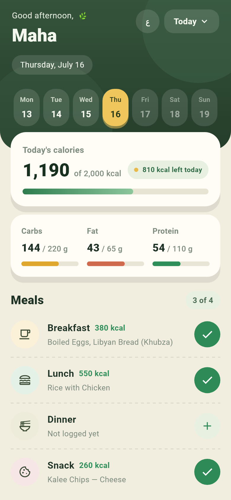
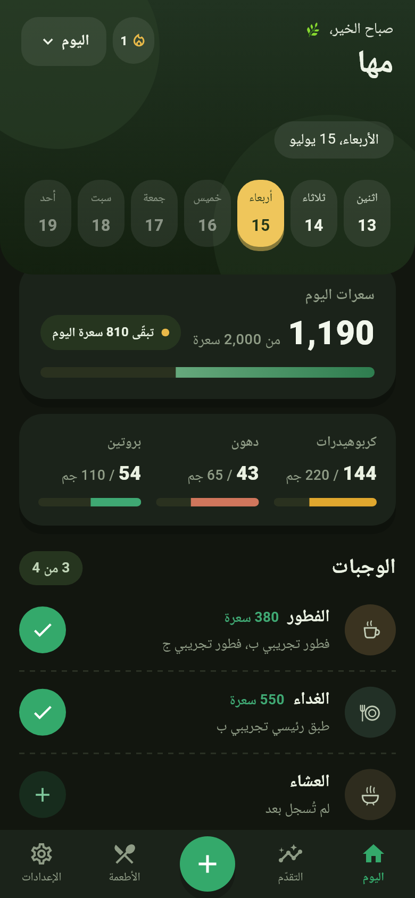

# Zibda · زبدة

A calorie tracking app for the Libyan market. Global calorie apps don't
cover Libyan products — this one does. Named Libyan home dishes (bazin,
mbakbka, usban, sfinz, maqrud) are planned but not in the database yet —
today's coverage is local packaged brands (Al Naseem and others) and the
everyday ingredients those dishes are built from.

## Why it's different

- **Libyan food coverage**: local packaged brands like Al Naseem, plus
  everyday ingredients — searchable in Arabic or English
- **Full Arabic RTL** with a one-tap language toggle
- **Works completely offline** — no connection needed, ever
- **No account required**, no sign-up
- **No ads, no tracking** — your data never leaves your phone

| Home (English, light) | Home (Arabic, dark) |
| :---: | :---: |
|  |  |

**[Try the live web demo](https://abdulmoezshadi90-art.github.io/calorie_tracker/)**

## Tech

Flutter. Local-only storage by design — there is no backend. Deliberately
tiny dependency footprint to keep the APK small for older phones.

## Design assets
App icon and splash artwork are authored in Figma and exported to
`assets/icons/` and `assets/branding/`. Figma is the single source of
truth — do not regenerate these programmatically.

## Status

In private beta. Public launch planned for December 2026.

## Data status

Packaged food values come from product labels; home dish values are
estimates from documented reference recipes. Entries carry a source note
and a verified flag in [food_db.dart](lib/food_db.dart) — values marked
unverified there are placeholders pending label verification.

## Legal

Source available. All rights reserved.

Provided as is, without warranty of any kind.

This app provides nutritional estimates and is not medical advice.
Consult a doctor or dietitian for medical conditions.

Product and brand names appearing in the food database are the property
of their respective owners and are used for identification only.

[Privacy policy](https://abdulmoezshadi90-art.github.io/calorie_tracker/privacy.html)
